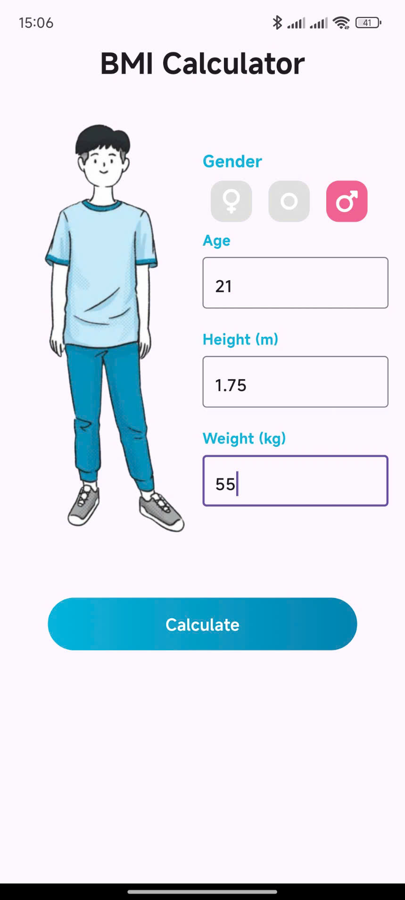
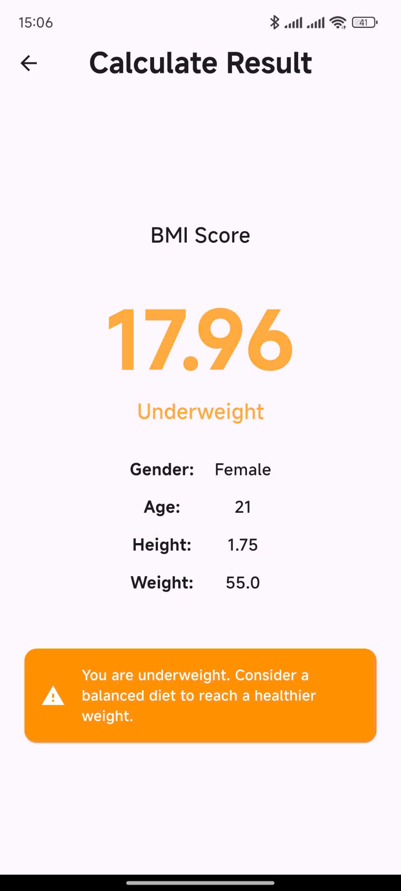

# 🧮 BMI Calculator App

A simple and beautiful Flutter app that helps users calculate their Body Mass Index (BMI) and get personalized health feedback.


## 📱 Features

- 🧑‍⚕️ Input gender, age, height, and weight
- 📊 Auto calculate BMI based on WHO formula
- 🧠 Personalized result & health message
- 💡 Clean and intuitive UI using Material Design

---

## 🚀 Getting Started

### ✅ Prerequisites

- Flutter SDK ≥ 3.x
- Android Studio or VS Code
- A physical or virtual device

### 📦 Installation

```bash
# Clone the repository
git clone https://github.com/your-username/bmi_calculator_flutter.git

# Navigate into the project directory
cd bmi_calculator_flutter

# Install dependencies
flutter pub get

# Run the app
flutter run
```

---

## 📷 Screenshots

| Input Screen                    | Result Screen                           |
|---------------------------------|-----------------------------------------|
|  |  |

---

## 🛠 Tech Stack

- **Flutter** – Frontend framework
- **Dart** – Programming language
- **Material Design** – UI principles


## 🤝 Contributing

Contributions, issues, and feature requests are welcome!  
Feel free to check the [issues page](https://github.com/your-username/bmi_calculator_flutter/issues).

---

## ⭐ Support This Project

If you like this app, please consider giving it a ⭐ star to support the project and encourage further development!

